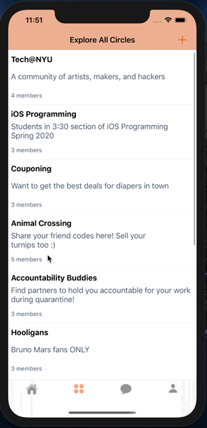
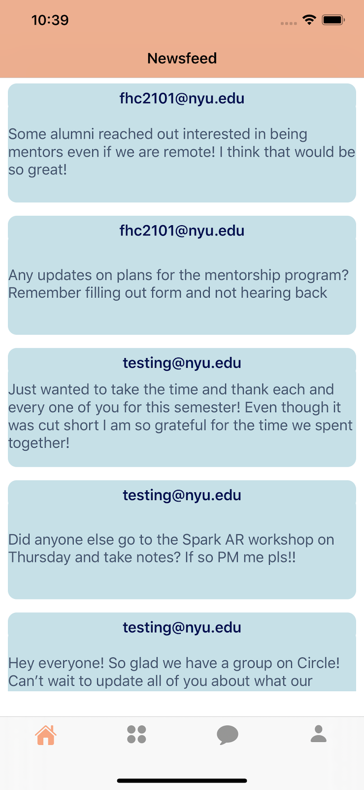
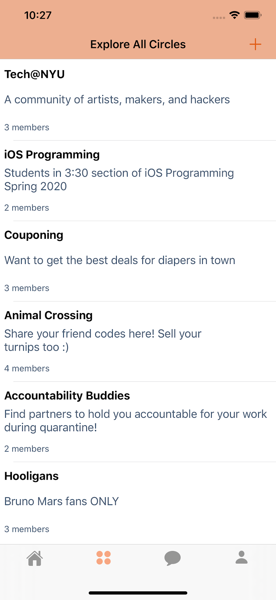
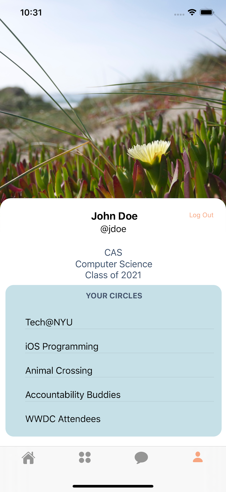

# Circle
## iOS Final Project - Spring 2020
### [Ivanna Pena](https://www.linkedin.com/in/ivannapena/) & [Leena Loo](https://www.linkedin.com/in/leena-loo-113533131/)

**```Circle```** is a real-time group and private messaging app in Swift for iOS devices. Its goal is to help the NYU community, and other colleges, stay connected in a more casual way than current class discussion boards even after the pandemic ends. This application will allow users to create accounts and profiles if they are students at an accredited university, and interact with other students strictly from their university. This will be done via forums and messaging categorized by different interests, classes, or majors.


 


### Requirements
- Xcode version 11.4.1+
- Swift 5
- iPhone 11 Pro Max or higher
- iOS 13.0+

### Functionality
- Real-time Group Messaging
- Interest Group Creation with Unlimited Members
- Real-time Private Messaging
- Customize User Profile

### How to install?
1. Install [CocoaPods](https://guides.cocoapods.org/using/getting-started.html)
2. Open Terminal and run ```pod install``` directly in ```circle/Circle``` folder.
3. Open the Circle.xcworkspace in Xcode.
4. Change the Bundle Identifier to your domain.
5. For Firebase to run, create a [new project](https://console.firebase.google.com/u/0/) for your application.
4. Download ```GoogleService-Info.plist``` from your newly created Firebase project and replace it with the old one. [screenshot](https://imgur.com/D4aBcEx)
5. Enable [Email/Password authentication method](https://firebase.google.com/docs/auth/web/password-auth)
6. Create [Realtime Database](https://firebase.google.com/docs/database/ios/start)
7. Set Realtime Database rules to:
```
{
  "rules": {
     ".read": true,
     ".write": true     
  }
}
```
8. Enable your Firebase [Storage](https://firebase.google.com/docs/storage)
9. Run Circle on your iOS Simulator for an iPhone 11 Pro Max

  

### Credits
- [Firebase](https://firebase.google.com/)
- [Chit-Chat](https://github.com/vinothvino42/Chit-Chat)
- [Making a Messaging App: Episode 4](https://www.youtube.com/watch?v=bIRZSEc3gGU&list=PL-RPl2RNV4fERNE3Nb0j48IWOhAV39P3K&index=4)
- [SoundSnap](https://www.soundsnap.com/)
- [OpenPeeps](OpenPeeps)


### Future Work
-  Debugging messaging (the cells dynamically change height when scrolling and constraints are overlapping); also need to make previews show the correct preview  
-  Show join circle button only if a user is not part of the circle, and only show post in circle button if user is part of the circle  
-  Adding more fields to our database  
-  Show profile pictures for users and groups in all of the view controllers  
-  Improving Newsfeed UI, by sending the user to the cells respective group on click  
-  Figure out how to get username instead of email  
-  User circles on Profile as a collection view and make Profile scrollable  
-  The option to sign in with Google
-  Send email verification on sign up for security
-  User Status Light, to determine if a user is currently on the app
-  Implement video chat
-  Adding security features and filters for posts, picture sending in messages
-  Ability to report users
-  Expanding to more schools than just NYU (will need to have different databases)
